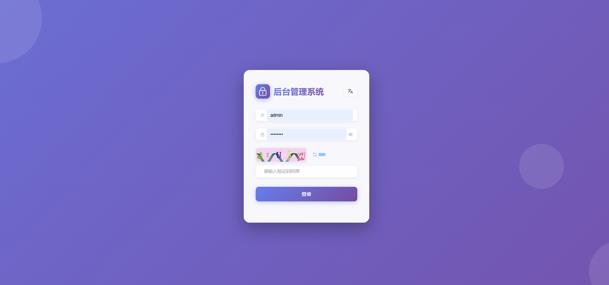
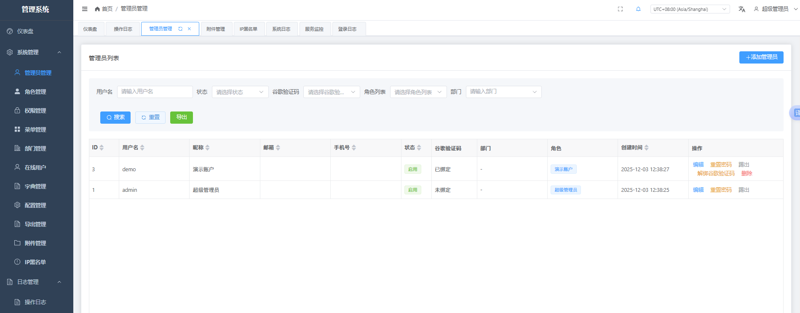
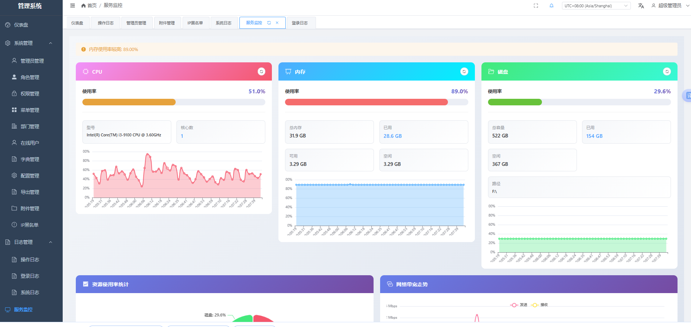

<p align="center"></p>

[English](./README.md) | 中文

## 关于 Goravel

Goravel 是一个功能完整、可扩展性良好的 Web 应用框架。作为起始脚手架，帮助 Gopher 快速构建自己的应用程序。

框架风格与 [Laravel](https://github.com/laravel/laravel) 保持一致，让 Phper 无需学习新框架，也能愉快地使用 Golang！致敬 Laravel！

欢迎 Star、PR 和 Issues！

## 后台管理系统

本项目包含一个基于 Goravel 框架构建的完整后台管理系统。

> 演示站 https://admin.xuancheng888.top

账号: demo  
密码: demo123


### 截图展示

<p align="center">
  
  <p align="center">登录页面</p>
</p>

<p align="center">
  
  <p align="center">后台管理界面</p>
</p>

<p align="center">
  
  <p align="center">系统监控</p>
</p>

### 功能特性

#### 核心模块
- **认证与授权**
  - 基于角色的访问控制（RBAC）
  - 权限管理
  - 多令牌管理
  - 在线用户监控与踢出

- **管理员管理**
  - 管理员用户管理
  - 部门管理
  - 角色管理
  - 权限分配
  - 密码重置

- **系统配置**
  - 菜单管理（动态菜单）
  - 字典管理
  - 系统配置
  - 黑名单管理

- **日志与监控**
  - 操作日志（自动记录）
  - 登录日志
  - 系统日志（带追踪 ID）
  - 服务监控

- **附加功能**
  - 数据统计仪表盘
  - 通知中心（WebSocket 实时通知）
  - 数据导出管理
  - 多语言支持（中文/英文）
  - 响应式 UI 设计

### 技术栈

**后端：**
- Goravel 框架（Go）
- JWT 认证
- RBAC 权限系统
- WebSocket 支持
- 数据库迁移与填充

**前端：**
- Vue 3
- Element Plus
- vxe-table（高级表格组件）
- Vue Router
- Pinia（状态管理）
- Axios
- ECharts（数据可视化）
- vue-i18n（国际化）

### 快速开始

1. **后端配置：**
   ```bash
   # 安装依赖
   go mod download
   
   # 在 .env 中配置数据库
   # 运行数据库迁移和填充
   go run . artisan migrate
   go run . artisan db:seed
   
   # 启动服务
   go run . --no-ansi
   # 或使用 air 进行热重载
   air
   ```

2. **前端配置：**
   ```bash
   cd html
   
   # 安装依赖
   npm install
   
   # 在 .env 中配置 API 地址
   # VITE_API_BASE_URL=http://127.0.0.1:3000
   # VITE_API_PREFIX=/api/admin
   
   # 启动开发服务器
   npm run dev
   ```

3. **默认登录：**
   - 用户名：`admin`
   - 密码：`admin123`
   - （首次登录后请修改默认密码）

### 构建与部署

详细的编译打包和部署说明，包括跨平台编译、Docker 部署、systemd 服务配置等，请参考 [BUILD.md](./BUILD.md)。

### API 文档

后台管理 API 接口前缀为 `/api/admin`。除登录和验证码接口外，所有接口都需要 JWT 认证。

详细的 API 文档请查看 [routes/admin.go](./routes/admin.go)

#### Swagger API 文档

项目包含 Swagger API 文档，支持交互式 API 探索。

**访问 Swagger 文档：**

Swagger JSON 文档访问地址：
- 本地开发：`http://localhost:3000/swagger/index.html`
- 生产环境：`https://your-domain.com/swagger/index.html`

**重新生成 Swagger 文档：**

修改 API 路由或添加新接口后，需要重新生成 Swagger 文档：

```bash
# 生成 Swagger 文档
swag init
```

这将根据代码中的 Swagger 注解（示例见 `main.go`）重新生成 `docs/docs.go`、`docs/swagger.json` 和 `docs/swagger.yaml` 文件。

### 项目结构

```
.
├── app/
│   ├── http/
│   │   ├── controllers/admin/    # 后台控制器
│   │   ├── middleware/           # 自定义中间件（JWT、权限、操作日志）
│   │   └── helpers/              # 辅助函数
│   ├── models/                   # 数据库模型
│   └── services/                 # 业务逻辑服务
├── routes/
│   └── admin.go                  # 后台路由
├── database/
│   ├── migrations/               # 数据库迁移
│   └── seeders/                  # 数据库填充
├── html/                         # 前端 Vue 应用
│   └── src/
│       ├── views/                # 页面组件
│       ├── components/           # 可复用组件
│       ├── api/                 # API 客户端
│       └── store/               # Pinia 状态管理
├── config/                       # 配置文件
├── BUILD.md                      # 编译打包和部署文档
└── images/                       # 截图文件
```

### 安全特性

- 基于 JWT 令牌的认证
- 权限中间件保护路由
- 自动操作日志记录
- 日志中敏感数据过滤
- 登录接口限流
- IP/管理员黑名单管理
- 令牌撤销支持

## 快速入门

### 启动服务

`go run . --no-ansi` 或 `air`

[关于 air]：https://www.goravel.dev/getting-started/installation.html#live-reload

### Cloudflare Workers 部署

将前端应用部署到 Cloudflare Workers：

```bash
# 构建前端应用
cd html
npm install && npm run build

# 部署到 Cloudflare Workers
npx wrangler deploy --assets ./dist --compatibility-date 2025-11-29 --name admin
```

**配置说明：**

- **根目录：** `html`
- **环境变量（变量和机密）：**
  - `VITE_API_BASE_URL`: `https://api.xuancheng888.top`
  - `VITE_API_PREFIX`: `/api/admin`
- **自定义域名：** `admin.xuancheng888.top`

**注意：** `worker.js` 文件会自动处理 SPA 路由，当文件不存在时返回 `index.html`。

### 性能分析

pprof 性能分析工具地址：http://localhost:3000/debug/pprof/

### 二进制压缩

为了减小二进制文件大小，可以使用 UPX（Ultimate Packer for eXecutables）压缩编译后的可执行文件：

**Windows：**

1. 下载 UPX（Windows 64 位版本）：
   - 官网下载：https://github.com/upx/upx/releases/latest
   - 选择 `upx-5.0.2-win64.zip`（或最新版本）
   - 解压到无中文或空格的路径（例如：`F:\tools\upx`）
   - 确保 `upx.exe` 可访问

2. 压缩二进制文件（PowerShell）：
   ```powershell
   # 方式1：临时添加 UPX 到环境变量（推荐）
   $env:PATH += ";F:\tools\upx"
   
   # 进入项目目录
   cd F:\www\go\admin\goravel-admin
   
   # 最高级别压缩（-9）
   upx -9 main
   ```

**Linux/macOS：**

```bash
# 安装 UPX（如果尚未安装）
# Ubuntu/Debian: sudo apt-get install upx
# macOS: brew install upx

# 压缩二进制文件
upx -9 main
```

## 文档

在线文档 [https://www.goravel.dev](https://www.goravel.dev)

> 要优化文档，请向文档仓库提交 PR
> [https://github.com/goravel/docs](https://github.com/goravel/docs)

## 社区

欢迎在 Discord 中讨论。

[https://discord.gg/cFc5csczzS](https://discord.gg/cFc5csczzS)

## 许可证

Goravel 框架是在 [MIT 许可证](https://opensource.org/licenses/MIT) 下发布的开源软件。


